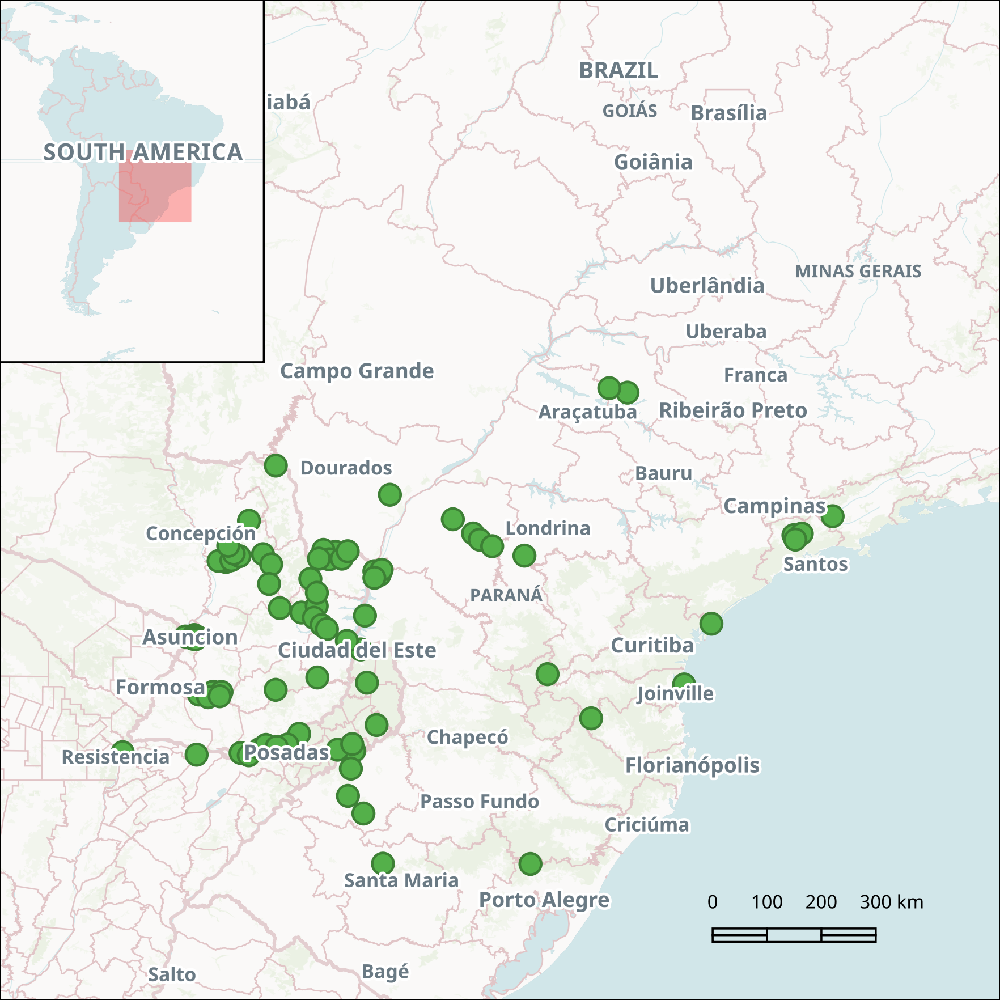

# indigenous-resistance
A colonial-era dataset of geolocated Indigenous resistance events around the southern Atlantic Forest.


Compiled from archival research by [Freg Stokes](https://www.fregjstokes.com/) c. 2015-2025 as part of his doctoral thesis, [_The Hummingbird’s Atlas: Mapping Guaraní Resistance in the Atlantic Rainforest during the Emergence of Capitalism (1500–1768)_](https://hdl.handle.net/11343/319482).



## spatial data information

```
INFO: Open of `indigenous-resistance.gpkg'
      using driver `GPKG' successful.

Layer name: indigenous-resistance
Geometry: Point
Feature Count: 84
Extent: (-58.755864, -29.514083) - (-45.908354, -20.902321)
Layer SRS WKT:
GEOGCRS["WGS 84",
    ENSEMBLE["World Geodetic System 1984 ensemble",
        MEMBER["World Geodetic System 1984 (Transit)"],
        MEMBER["World Geodetic System 1984 (G730)"],
        MEMBER["World Geodetic System 1984 (G873)"],
        MEMBER["World Geodetic System 1984 (G1150)"],
        MEMBER["World Geodetic System 1984 (G1674)"],
        MEMBER["World Geodetic System 1984 (G1762)"],
        MEMBER["World Geodetic System 1984 (G2139)"],
        MEMBER["World Geodetic System 1984 (G2296)"],
        ELLIPSOID["WGS 84",6378137,298.257223563,
            LENGTHUNIT["metre",1]],
        ENSEMBLEACCURACY[2.0]],
    PRIMEM["Greenwich",0,
        ANGLEUNIT["degree",0.0174532925199433]],
    CS[ellipsoidal,2],
        AXIS["geodetic latitude (Lat)",north,
            ORDER[1],
            ANGLEUNIT["degree",0.0174532925199433]],
        AXIS["geodetic longitude (Lon)",east,
            ORDER[2],
            ANGLEUNIT["degree",0.0174532925199433]],
    USAGE[
        SCOPE["Horizontal component of 3D system."],
        AREA["World."],
        BBOX[-90,-180,90,180]],
    ID["EPSG",4326]]
Data axis to CRS axis mapping: 2,1
FID Column = fid
Geometry Column = geom
dates: String (11.0)
conflict_classification: String (56.0)
notes: String (172.0)
reference: String (310.0)
```

## attributes

|dates       |conflict_classification                                 |notes                                                                                                                                                                   |reference                                                                                                                                                                                                                                                                                                      |         x|         y|
|:-----------|:-------------------------------------------------------|:-----------------------------------------------------------------------------------------------------------------------------------------------------------------------|:--------------------------------------------------------------------------------------------------------------------------------------------------------------------------------------------------------------------------------------------------------------------------------------------------------------|---------:|---------:|
|1531        |Guayra Guaraní against Portuguese                       |Guaraní warriors in Guayra kill Portuguese explorer Pero Lobo and his party.                                                                                            |Cabeza de Vaca, Álvar Núñez. Naufragios y Comentarios. Ebook: Himali, 2013, 181.                                                                                                                                                                                                                               | -54.37110| -25.01982|
|1528        |Guaraní against Spanish                                 |Spanish crewmen Miguel Rifos and Gonzalo Nuñes are killed by Guaraní forces on the Paraguay river.                                                                      |Ramírez, Luis. Carta de Luis Ramírez a su Padre desde el Brasil (1528): Orígenes de lo ‘Real Maravilloso’ en el Cono Sur. Edited by Juan Francisco Maura. Lemir, 2007, 56-57.                                                                                                                                  | -57.62174| -25.39849|
|1537        |Guaraní against Spanish                                 |The Cario Guaraní resist Spanish colonist Juan Salazar de Espinoza as he establishes the fort of Asunción.                                                              |Irala, Domingo Martínez de, in El Gobernador Domingo Martínez de Irala, by Ricardo Lafuente Machain, 453–65. Buenos Aires: Librería y Editorial ‘La Facultad’, Biblioteca de la Sociedad de Historia Argentina, 1939, 385.                                                                                     | -57.45084| -25.42999|
|1545        |Guaraní against Spanish                                 |A general Guaraní uprising against the Spanish near Asunción and its hinterlands.                                                                                       |Irala in Machain, El Gobernador, 429, 500                                                                                                                                                                                                                                                                      | -57.39736| -25.40689|
|1542        |Paraná Guaraní against Spanish                          |Guaraní forces attack a Spanish flotilla on the Paraná river.                                                                                                           |Cabeza de Vaca, Naufragios, 189                                                                                                                                                                                                                                                                                | -55.56161| -27.15805|
|1556        |Guaraní against Spanish                                 |Guaraní workers conduct a spiritually inspired labour strike in Asunción and surrounding region.                                                                        |Candela, Guillaume. Entre la Pluma y la Cruz: El Clérigo Martín González y la Desconocida Historia de su Defensa de los Indios del Paraguay, Documentos Inéditos (1543–1575). Asunción: Tiempo de Historia, 2018, 122.                                                                                         | -57.46181| -25.37181|
|1539        |Guaraní against Spanish                                 |Guaraní farmers near Asunción attack a Spanish incursion then abandon their villages and orchards.                                                                      |Roulet, Florencia, La Resistencia de los Guarani del Paraguay a la Conquista Española (1537–1556). Posadas: Editorial Universitaria, Universidad Nacional de Misiones, 1993, 126.                                                                                                                              | -57.43024| -25.40801|
|1559-1560   |Guaraní against Spanish                                 |A Guaraní revolt against the Spanish led by Don Pablo and Don Nazario, sons of Curupiratí, south of Asunción.                                                           |Necker, Louis. Indios Guaranies y Chamanes Franciscanos. Asunción: Biblioteca Paraguaya de Antropologia, Vol. 7, 1990, 220.                                                                                                                                                                                    | -57.47005| -25.41251|
|1564-1568   |Guaraní against Spanish                                 |A general Guaraní uprising against the Spanish, including around Asunción.                                                                                              |Necker, Indios Guaranies, 220                                                                                                                                                                                                                                                                                  | -57.42129| -25.42689|
|1568-1571   |Guaraní against Spanish                                 |Sporadic Guaraní uprisings against the Spanish, including around Asunción.                                                                                              |Necker, 220-221                                                                                                                                                                                                                                                                                                | -57.49294| -25.41430|
|1575        |Guaraní against Spanish                                 |A general Guaraní revolt against the Spanish from the Atlantic coast to Paraguay, including Asunción.                                                                   |Roulet, La Resistencia, 260                                                                                                                                                                                                                                                                                    | -57.48896| -25.43588|
|1589        |Guaraní against Spanish                                 |Guaraní and Spanish populations near Asunción enter into conflict.                                                                                                      |Necker, Indios Guaranies, 221                                                                                                                                                                                                                                                                                  | -57.43920| -25.44756|
|1545        |Guaraní against Spanish                                 |A general Guaraní revolt against the Spanish across Paraguay, including in the Tebicuary river region.                                                                  |Necker, 219                                                                                                                                                                                                                                                                                                    | -57.37750| -26.44716|
|1559-1560   |Guaraní against Spanish                                 |A Guaraní revolt against the Spanish led by Don Pablo and Don Nazario, sons of Curupiratí, in the Tebicuary river region.                                               |Necker, 220                                                                                                                                                                                                                                                                                                    | -57.11873| -26.39725|
|1589        |Guaraní against Spanish                                 |Guaraní revolts against the Spanish in the Tebicuary river region, driven by shamans rejecting the encomiendas.                                                         |Necker 221                                                                                                                                                                                                                                                                                                     | -56.96746| -26.40082|
|1591        |Guaraní against Spanish                                 |Tebicaury Guaraní groups fight the incursion of Pedro de Lapuente y Alonso de Vera y Aragón.                                                                            |Necker, 222                                                                                                                                                                                                                                                                                                    | -57.21030| -26.49705|
|1592        |Guaraní against Spanish                                 |Military conflict between Spanish and Guaraní forces in the Tebicuary region.                                                                                           |Necker, 222                                                                                                                                                                                                                                                                                                    | -56.99931| -26.47924|
|1559-1560   |Paraná Guaraní against Spanish                          |A Guaraní revolt against the Spanish led by Don Pablo and Don Nazario, sons of Curupiratí, reaching the Paraná region.                                                  |Necker, 220                                                                                                                                                                                                                                                                                                    | -56.62111| -27.50439|
|1598-1599   |Paraná Guaraní against Spanish                          |Hernanderias enters into conflict with the Paraná Guaraní, who have been killing travellers on the rivers.                                                              |Necker, 222                                                                                                                                                                                                                                                                                                    | -55.77317| -27.35245|
|1568        |Paraná Guaraní against Spanish                          |The Paraná Guaraní attack Felipe de Cáceres.                                                                                                                            |Necker, 220                                                                                                                                                                                                                                                                                                    | -56.47382| -27.54676|
|1589        |Paraná Guaraní against Spanish                          |The Paraná Guaraní resist Spanish incursions.                                                                                                                           |Necker, 221                                                                                                                                                                                                                                                                                                    | -56.27079| -27.43021|
|1591-1594   |Paraná Guaraní against Spanish                          |The Parana Guaraní resist Spanish incursions                                                                                                                            |Necker, 222                                                                                                                                                                                                                                                                                                    | -56.16330| -27.35952|
|1564-1568   |Jejuy Guaraní against Spanish                           |A general Guaraní uprising against the Spanish, including in the Jejuy river region.                                                                                    |Necker, 220                                                                                                                                                                                                                                                                                                    | -56.88784| -24.04938|
|1543        |Jejuy Guaraní against Spanish                           |A Guaraní revolt against Spanish in Jejuy river region led by Taberé and Guacany.                                                                                       |Necker 219                                                                                                                                                                                                                                                                                                     | -57.01921| -24.03120|
|1575        |Jejuy Guaraní against Spanish                           |Guaraní revolts against the Spanish due to Spanish raids in Jejuy and Itatim regions.                                                                                   |Roulet 264                                                                                                                                                                                                                                                                                                     | -56.78831| -24.01666|
|1577-1579   |Jejuy Guaraní against Spanish                           |A large Guaraní rebellion north of the Jejuy river against the Spanish.                                                                                                 |Necker, 221                                                                                                                                                                                                                                                                                                    | -56.64188| -23.94417|
|1584-1586   |Jejuy Guaraní against Spanish                           |The abduction of women and children by the Spanish sparks another Guaraní rebellion on the Jejuy river.                                                                 |Necker, 221                                                                                                                                                                                                                                                                                                    | -56.74620| -23.89740|
|1545-1546   |Jejuy Guaraní against Spanish                           |A large Guaraní rebellion in Jejuy river region against Spanish in response to raids.                                                                                   |Roulet, La Resistencia, 203-214                                                                                                                                                                                                                                                                                | -56.84447| -23.75587|
|1570        |Mbaracayu Guaraní against Spanish                       |Spanish attempts to suppress Guaraní revolts on the road between Asunción and Guayra.                                                                                   |Necker, Indios Guaranies, 221                                                                                                                                                                                                                                                                                  | -55.35915| -24.35439|
|1559-1560   |Guayra Guaraní against Spanish                          |Guaraní rebellions in Guayra against the Spanish.                                                                                                                       |Necker, 220                                                                                                                                                                                                                                                                                                    | -54.20069| -24.21650|
|1568-1571   |Guayra Guaraní against Spanish                          |Guaraní rebellions in Guayra against the Spanish.                                                                                                                       |Necker, 220-221                                                                                                                                                                                                                                                                                                | -54.10515| -24.28546|
|1593        |Guayra Guaraní against Spanish                          |Spanish reports state that many of the Indigenous people of Guayra are in revolt.                                                                                       |Miño, Pero in Zeballos, Estanislao S., ed. Arbitration Upon a Part of the National Territory of Misiones Disputed by the United States of Brazil. Argentine Evidence Laid Before the President of the United States of America (Volume 1). New York: S. Figueroa, 1893, 242.                                   | -54.06932| -24.19108|
|1575        |Guayra Guaraní against Spanish                          |The Guaraní of Guayra rebel against the town of Villa Rica.                                                                                                             |Roulet, Resistencia, 264                                                                                                                                                                                                                                                                                       | -52.41468| -23.53337|
|1593        |Guayra Guaraní against Spanish                          |Spanish reports state that many of the Indigenous people of Guayra are in revolt.                                                                                       |Miño, Pero, in Zeballos, Arbitration, 183, 242.                                                                                                                                                                                                                                                                | -52.29448| -23.64629|
|1556        |Guayra Guaraní against Spanish                          |A general Guaraní revolt against the Spanish from the Atlantic coast to Paraguay, including Guayra.                                                                     |Roulet, La Resistencia, 260                                                                                                                                                                                                                                                                                    | -54.20069| -24.33626|
|1556        |Carijó Guaraní against Spanish                          |Anti-encomienda Guaraní rebellions against the Spanish in San Francisco on the Atlantic Coast.                                                                          |Roulet, 260                                                                                                                                                                                                                                                                                                    | -48.59550| -26.26524|
|1562-1565   |Tupiniquim against Portuguese                           |Rebel Tupiniquins, led by Piquerobi and Jaguaranho, besiege São Paulo for three years.                                                                                  |Monteiro, John Manuel, Negros da Terra: Indios e Bandeirantes nas Origines de São Paulo. São Paulo: Companhia das Letras, 1994, 39.                                                                                                                                                                            | -46.61696| -23.56497|
|1554-1567   |Tamoio alliance against Portuguese                      |The Tamoio ('grandparents' in Tupi) confederation between various Tupinambá groups resists Portuguese colonisation.                                                     |Monteiro, Negros da Terra, 39-40                                                                                                                                                                                                                                                                               | -45.90835| -23.22152|
|1589        |Paraná Guaraní against Spanish                          |The Paraná Guaraní besiege the Spanish city of Corrientes.                                                                                                              |Necker, Indios Guaranies, 221                                                                                                                                                                                                                                                                                  | -58.75586| -27.49072|
|1590-1595   |Jê, Tupiniquim and Carijó against Portuguese            |A revolt againt Portuguese colonists and Jesuits by Indigenous groups on Pinheiros mission, São Paulo.                                                                  |Monteiro, Negros da Terra, 51                                                                                                                                                                                                                                                                                  | -46.46595| -23.53612|
|1554        |Carijó Guaraní against Portuguese                       |Carijó Guaraní opponents kill the Portuguese Jesuit missionaries Pero Correia and João de Sousa on the coast near Cananeia.                                             |Serafim Leite, História da Companhia de Jesus no Brasil (Século XVI–A Obra), vol. II (Rio de Janeiro: Civilização Brasileira, 1938), 236-241                                                                                                                                                                   | -48.10128| -25.16591|
|1591-1606   |Paraná Guaraní against Spanish                          |Despite the earlier campaign by Hernandarias, the Paraná Guaraní continue rebelling.                                                                                    |Necker, Indios Guaranies, 222                                                                                                                                                                                                                                                                                  | -55.96798| -27.39450|
|1608        |Bilheiros against Portuguese                            |Belchior Dias Carneiro's expedition is attacked by the Bilreiros/southern Kayapó in the northwest of modern São Paulo state.                                            |Monteiro, Negros da Terra, 60, 64.                                                                                                                                                                                                                                                                             | -49.62022| -20.98478|
|1624        |Guayra Guaraní against Spanish                          |The Guaraní leader Guiravera obstructs Spanish expansion on the Ivaí river in Guayra, eating anyone who tries to pass.                                                  |Montoya, Antonio Ruíz de, in Manuscritos da Coleção de Angelis I: Jesuítas e Bandeirantes no Guairá (1594–1640) [hereafter MCA I]. Rio de Janeiro: Biblioteca Nacional, 1951, 288                                                                                                                              | -52.06877| -23.76441|
|1626-1627   |Guayra Guaraní against Spanish Jesuits                  |A Guaraní woman from the Paraná river calls herself the Mother of God and convinces her followers to leave the Spanish Jesuit mission of Santa María del Iguazú.        |Ardanaz, Daisy Ripodas, ‘Movimientos Shamanicos de Liberación entre los Guaranies (1545–1660)’. Teología 50 (1987), 265.                                                                                                                                                                                       | -54.44760| -25.63240|
|1628        |Tape Guaraní against Spanish Jesuits                    |The Guaraní leaders Ñezu and Potirava assassinate three Spanish Jesuits in Tape, modern Rio Grande do Sul. Ñezu escapes without punishment.                             |Trujillo, Francisco Vásquez, ‘Relación del Glorioso Martyrio de los Sanctos Padres Roque Gonçalez, Alonso Rodrigo y Juan del Castillo’, 1629, Arquivo Romanum Societatis Iesu, Paraquarie 11, Doc. 50, folios 180–189v.                                                                                        | -54.67922| -28.28222|
|1635        |Tape Guaraní against Spanish Jesuits                    |Guaraní forces led by Yaguacaporu and an 'Indian Sorceress' attack the Spanish Jesuit missions in Tape.                                                                 |Anonymous, ‘Relacion de lo Acaecido en las Reducciones de la Sierra y Especialmente en la de Jesus Maria, dispues del Martirio del P. Cristobal de Mendoza’, c.1630s, Biblioteca Nacional do Rio de Janeiro, 1–29, 1, 55, Doc. 303, folio 32.                                                                  | -51.37640| -29.51408|
|1612        |Jê, Tupi and Carijó against Portuguese                  |Disturbances in the Portuguese Jesuit mission of Barueri near São Paulo.                                                                                                |Monteiro, Negros da Terra, 51                                                                                                                                                                                                                                                                                  | -46.58280| -23.64497|
|1616        |Jejuy Guaraní against Spanish                           |The dead chief Tanimbaguazú speaks from within a Guaraní woman's womb, his followers kill Spanish cattle and flee to the forest.                                        |Ardanaz, 'Movimientos', 263-264.                                                                                                                                                                                                                                                                               | -56.21682| -23.90848|
|1621        |Itatim Guaraní against Portuguese                       |The Itatim Guaraní resist abduction and deportation by Bandeirantes to São Paulo.                                                                                       |Cortesão, Jaime (ed), Manuscritos da Coleção de Angelis II: Jesuítas e Bandeirantes no Itatim (1596–1760) [hereafter MCA II]. Rio de Janeiro: Biblioteca Nacional, 1952, 87, 317.                                                                                                                              | -53.91953| -22.83240|
|1625        |Guaraní against Spanish Franciscans                     |Juan Cuará turns Guaraní converts against the Spanish Franciscan missionaries of Itatí on the Paraná river and threatens to transform his enemies into frogs and toads. |Ardanaz, 'Movimientos', 264.                                                                                                                                                                                                                                                                                   | -57.41746| -27.53586|
|1627        |Tape Guaraní against Spanish Jesuits                    |The recently founded Spanish Jesuit mission of Candelaria del Ibicuy is destroyed by Tape Guaraní opponents.                                                            |Freitas da Silva, André Luis. Reduções Jesuítico-Guarani: Espaço de Diversidade Étnica. São Bernardo do Campo: Nhanduti, 2013, 77.                                                                                                                                                                             | -54.04547| -29.50872|
|1612        |Bilheiros against Portuguese                            |The Bilreiros/southern Kayapó fight Portuguese Bandeirantes in the northwest of modern São Paulo state.                                                                 |Monteiro, Negros da Terra, 64.                                                                                                                                                                                                                                                                                 | -49.94891| -20.90232|
|1628-1629   |Guayra Guaraní against Portuguese                       |Autonomous Guaraní forces on the Ivaí river defeat a Portuguese slave raid.                                                                                             |Justo Mancilla and Simon Maceta in MCA I, 319                                                                                                                                                                                                                                                                  | -52.78034| -23.27604|
|1628-1629   |Jé and Guaraní against Portuguese                       |The mixed Jé and Guaraní autonomous forces of Caayu resist Portuguese slave raids twice.                                                                                |Mancilla and Masseta in MCA I, 319                                                                                                                                                                                                                                                                             | -51.48516| -23.93441|
|1648        |Itatim Guaraní against Spanish                          |Many Itatim Guaraní turn on Spanish Jesuits, expel them and flee to the forest.                                                                                         |Luna, Pedro de Roxas y, in, MCA II, 280.                                                                                                                                                                                                                                                                       | -55.98399| -22.30445|
|1641        |Spanish Jesuit-allied Guaraní against Portuguese        |In the decisive battle of Mbororé, Guaraní forces allied with Spanish Jesuits defeat a Portuguese slave raid from São Paulo on the Uruguay river.                       |Henestrosa, Gregorio de, in Pastells, Pablo. Historia de la Compañia de Jesús en la Provincia del Paraguay (Argentina, Paraguay, Uruguay, Perú, Bolivia y Brasil), Según los Documentos Originales del Archivo General de Indias (1568–1638). Vol. 1. Madrid: Librería General de Victoriano Suárez, 1912, 58. | -54.56405| -27.46645|
|1639        |Spanish Jesuit-allied Guaraní against Portuguese        |Guaraní forces aligned with Spanish Jesuits obstruct the advance of a Portuguese Bandeira at Caazapamiri.                                                               |Boroa, Diego de, Manuscritos da Coleção de Angelis III: Jesuítas e Bandeirantes no Tape (1615–1641). Rio de Janeiro: Biblioteca Nacional, 1969, 299-300.                                                                                                                                                       | -54.39886| -28.60046|
|1656        |Guaraní against Spanish Franciscans                     |Autonomous Guaraní archers assist a successful mutiny on the Spanish Franciscan missions of Caazapá and Yuty.                                                           |Susnik, Branislava, El Rol de los Indígenas en la Formación y en la Vivencia del Paraguay. 3rd ed. Asunción: Intercontinental, 2017, 216-220.                                                                                                                                                                  | -55.98732| -26.36251|
|1660        |Guaraní against Spanish                                 |Autonomous Guaraní forces assist the Arecayá revolt then flee to the forest after Spanish reprisals.                                                                    |Susnik, El Rol, 216-220.                                                                                                                                                                                                                                                                                       | -56.06741| -24.09258|
|1699        |Guaraní against Spanish                                 |Autonomous Guaraní forces ('Monteses') attack Spanish yerba mate collectors at Mbaracayú. Guaraní yerba workers then also rebel and flee.                               |‘Expediente sobre las Hostilidades y Daños que Afectuan los Indios Infeles de la Nación Montes. Beneficio de la Yerba’, 1699–1733, Archivo Nacional de Asunción [hereafter ANA], Sección Historia, Vol.43, N.8, folios 67-102v.                                                                                | -54.90645| -23.86320|
|1699        |Guaraní against Spanish                                 |Autonomous Guaraní forces attack Spanish yerba mate collectors at Curyy.                                                                                                |‘Expediente’, ANA, f. 67-102v.                                                                                                                                                                                                                                                                                 | -55.52076| -24.96405|
|1676        |Mbayá Kadiweu against Spanish                           |Mbayá Kadiweu forces expel the Spanish Jesuits from north of the Jejuy river.                                                                                           |Mörner, Magnus. Actividades Politicas y Economicas de los Jesuitas en el Río de la Plata. Buenos Aires: Hyspamérica Ediciones Argentina, 1986, 62.                                                                                                                                                             | -56.46965| -23.30304|
|1653        |Jé against Portuguese                                   |Jê groups inflict losses on the bandeira of Domingos de Góis.                                                                                                           |Monteiro, Negros da Terra, 83-84                                                                                                                                                                                                                                                                               | -50.27707| -26.87823|
|1650s-1660s |Jé against Portuguese                                   |Jé groups resist ongoing Portuguese slave raids.                                                                                                                        |Monteiro, Negros da Terra, 83-84                                                                                                                                                                                                                                                                               | -51.06666| -26.07862|
|1701        |Guaraní against Spanish                                 |Autonomous Guaraní forces attack Spanish yerba mate collectors at Caaguague.                                                                                            |‘Expediente’, ANA, f. 67-102v.                                                                                                                                                                                                                                                                                 | -55.12390| -23.83023|
|1703        |Guaraní against Spanish                                 |Autonomous Guaraní forces ('Monteses') attack yerba mate collectors north at Caaguague. Guaraní yerba workers then also rebel and flee.                                 |‘Expediente’, ANA, f. 67-102v.                                                                                                                                                                                                                                                                                 | -55.01711| -24.00118|
|1703        |Guaraní against Spanish                                 |Autonomous Guaraní forces attack Spanish yerba mate collectors at Mbaracayú.                                                                                            |‘Expediente’, ANA, f. 67-102v.                                                                                                                                                                                                                                                                                 | -54.79019| -23.98898|
|1723        |Guaraní against Spanish                                 |Autonomous Guaraní forces attack Spanish yerba mate collectors at Mbaracayú.                                                                                            |‘Expediente’, ANA, f. 67-102v.                                                                                                                                                                                                                                                                                 | -54.68340| -23.85466|
|1726        |Guaraní against Spanish                                 |Autonomous Guaraní forces attack Spanish yerba mate collectors at Caaguague.                                                                                            |‘Expediente’, ANA, f. 67-102v.                                                                                                                                                                                                                                                                                 | -55.20399| -23.98898|
|1703        |Guaraní against Spanish                                 |Autonomous Guaraní forces attack Spanish yerba mate collectors at Curyy.                                                                                                |‘Expediente’, ANA, f. 67-102v.                                                                                                                                                                                                                                                                                 | -55.24436| -24.84528|
|1726        |Guaraní against Spanish                                 |Autonomous Guaraní forces attack Spanish yerba mate collectors at Curyy.                                                                                                |‘Expediente’, ANA, f. 67-102v.                                                                                                                                                                                                                                                                                 | -55.29582| -25.05808|
|1760s       |Jé against Spanish Jesuits                              |Resistance to the Spanish Jesuit missions by 'Tupis', actually Jê-speaking Kaingang groups, east of the Uruguay river near San Javier.                                  |Azara, Felix de. Geografía Física y Esférica de las Provincias del Paraguay y Misiones Guaraníes. Edited by Rodolfo R. Schuller. 1790. Reprint, Montevideo: Anales del Museo Nacional de Montivedeo, 1904, 402-403                                                                                             | -54.62579| -27.78872|
|1740s       |Aché against Spanish Jesuits                            |‘Caribes’, most likely Aché Guaraní groups, resist Spanish Jesuit incursions into the forest.                                                                           |Nusdorffer, Bernardo, Manuscritos da Coleção de Angelis VII: Do Tratado de Madri à Conquista dos Sete Povos (1750–1802). Rio de Janeiro: Biblioteca Nacional, 1969, 147.                                                                                                                                       | -54.86606| -27.44572|
|1734-1735   |Tobatin Guaraní against Spanish                         |Tobatines rebel and abandon their Jesuit mission in 1734, then attack Spanish colonists in the forest and burn their yerba supplies.                                    |Villasanti, Pedro Cavallero, in Salinas, María Laura, ed. Cartas Anuas de la Provincia Jesuítica del Paraguay 1714–1720. 1720–1730. 1730–1735. 1735–1743. 1750–1756. 1756–1762. Asunción: CEADUC, Biblioteca de Estudios Paraguayos Volumen 102, 2016, 563, 565.                                               | -55.91178| -24.88394|
|1700s       |Jé against Spanish Jesuits                              |Resistance to the Spanish Jesuit missions by 'Tupis', actually Jê-speaking Kaingang groups.                                                                             |Azara, Geografía Física, 402-403.                                                                                                                                                                                                                                                                              | -54.60160| -27.34257|
|1716        |Spanish Jesuit-allied Guaraní against Spanish colonists |Guaraní forces from the Jesuit missions expel Spanish colonists from the yerba stand of Carema.                                                                         |Telesca, Ignacio. Documentos Jesuíticos del Siglo XVIII, en el Archivo Nacional de Asunción. Asunción: CEPAG, 2006, 61, 62.                                                                                                                                                                                    | -55.15539| -25.19056|
|c.1760-1762 |Guaraní against Spanish Jesuits                         |The autonomous Guaraní leader Tupachichú poisons his Jesuit-aligned rival Roy and leads his followers into the forest, away from Jesuit influence.                      |Dobrizhoffer, Martin. An Account of the Abipones, an Equestrian People of Paraguay. Vol. 1. 1784. Reprint, London: John Murray, 1822, 64-84.                                                                                                                                                                   | -54.69759| -25.47776|
|c.1762      |Guaraní against Spanish                                 |Autonomous Guaraní forces expel Spanish yerba mate collectors using arson, psychological intimidation, murder and theatrical speech-making.                             |Dobrizhoffer, Account of the Abipones, 1:85–87.                                                                                                                                                                                                                                                                | -55.05940| -25.26426|
|1764        |Spanish Jesuit-allied Guaraní against Spanish colonists |Guaraní forces from the Jesuit mission of San Estanislao expel Spanish yerba collectors from Capiibary.                                                                 |Susnik, Branislava, Una Visión Socio-Antropológica del Paraguay del Siglo XVIII. Asunción: Museo Etnografico Andrés Barbero, 2017, 129.                                                                                                                                                                        | -56.10616| -24.44742|
|1780-1795   |Guaraní against Spanish                                 |Spanish colonists abandon the yerba stands of Caaguegue and Curyy because of autonomous Guaraní attacks, including arson.                                               |Azara, Geografía Física, 209. See also ‘Expediente sobre la Necesidad de Despachar una Expedición contra los Indios Montés’, 1795, ANA, Sección Historia, Vol.163, N.6.                                                                                                                                        | -55.24115| -24.60649|
|1700s       |Aché against Iberian troops                             |Guayakies, Aché Guaraní groups, evade Spanish colonist and Jesuit mission attacks and maintain their autonomy in the forest.                                            |Lozano, Pedro. Historia de la Conquista del Paraguay, Río de la Plata y Tucuman. Vol. I. Buenos Aires: Imprenta Popular, 1873, 415-420.                                                                                                                                                                        | -55.23244| -26.13939|
|1754        |Aché against Spanish Jesuits                            |Autonomous ‘Caribes’/Aché kill members of a group of Spanish mercenaries sent by the Portuguese against the Jesuit missions (jaguars may have also eaten some of them). |Nusdorffer, Bernardo, Manuscritos da Coleção de Angelis VII: Do Tratado de Madri à Conquista dos Sete Povos (1750–1802). Rio de Janeiro: Biblioteca Nacional, 1969, 295.                                                                                                                                       | -54.33473| -26.23272|
|1700s       |Jé against Spanish Jesuits                              |Resistance to the Spanish Jesuit missions by 'Tupis', actually Jê-speaking Kaingang groups.                                                                             |Azara, Geografía Física, 402-403.                                                                                                                                                                                                                                                                              | -54.16092| -26.99895|


---